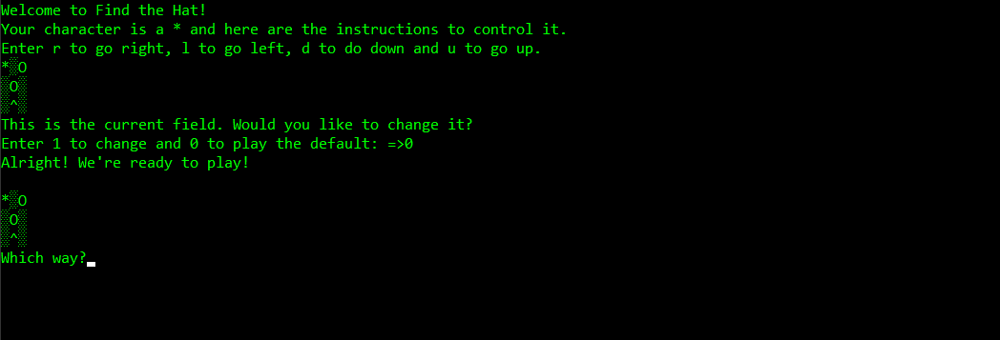

# Find the Hat game

This repository consists of a game made using node.js

---

## Technologies used

1. Node.js 
2. Git and Github 
3. Terminal 

---

## How to run

1. Open `terminal` and make sure you have node installed using `node --version`.
2. Install `prompt-sync` using the command `npm install prompt-sync`
3. Type `node main.js` and the game will start.

---

### Output

## Project status

This initial version of the project has been `completed`.

---